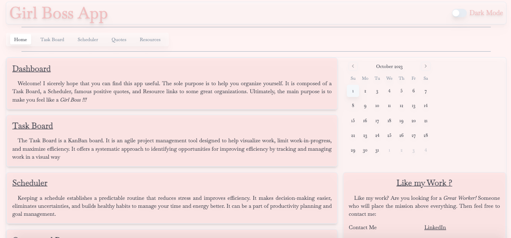
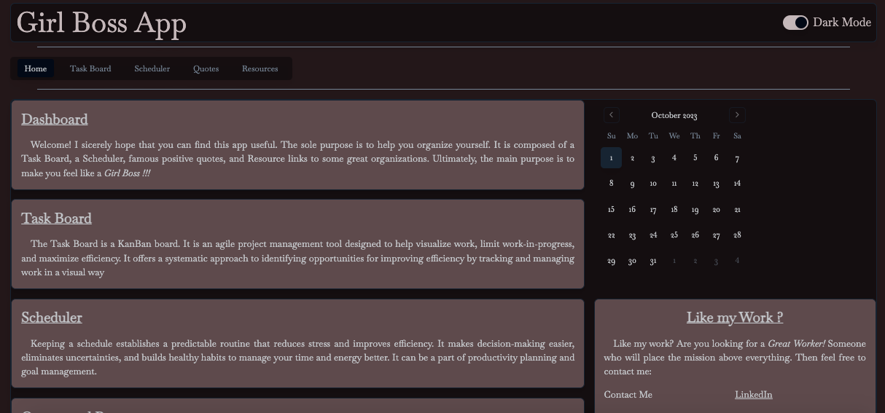
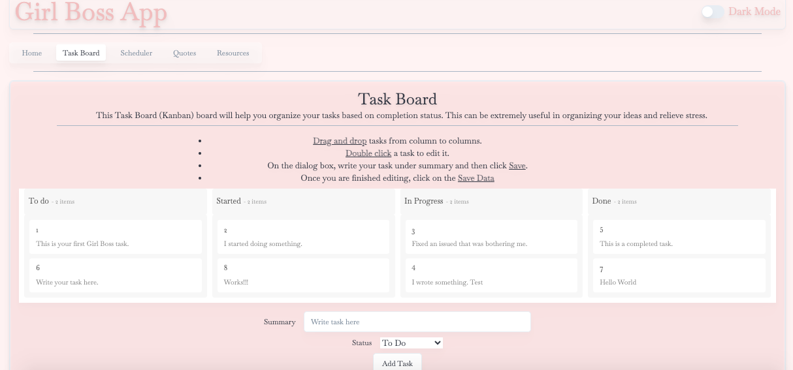
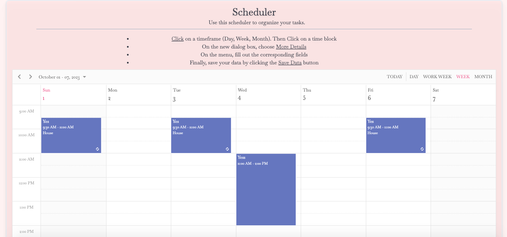

# girl-boss-app

[](https://opensource.org/licenses/MIT)

## Description

 This is the Girl Boss App, a SPA MERN site. It provides a set of tools for organizational purposes. It includes a KanBan board, a Scheduler, and Quotes received from MongoDB. Please enjoy


## Table of Contents

- [Installation](#installation)
- [Usage](#usage)
- [ScreenShot](#screenshot)
- [License](#license)
- [Contributing](#contributing)
- [Tests](#tests)
- [Questions](#questions)

## Installation

```bash
npm run install
npm run build
npm run start
```

## Usage

It is meant to be viewed online. Pleas visit its site

## ScreenShots

Dashboard

Dashboard (Dark Mode)

Task Board (Kan Ban)

Scheduler


## License

This project is covered under the following: MIT License

## Contributing

Submit a GitHub Issue.

## Tests

N/A

## Questions

Submit a GitHub Issue

Github User Name: rbarbosa51

Github Profile URL: https://github.com/rbarbosa51


